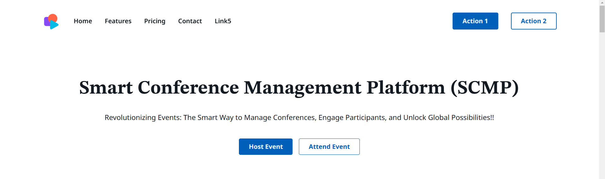
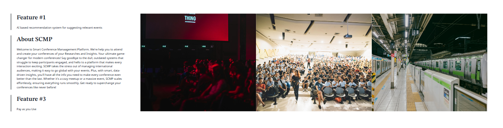
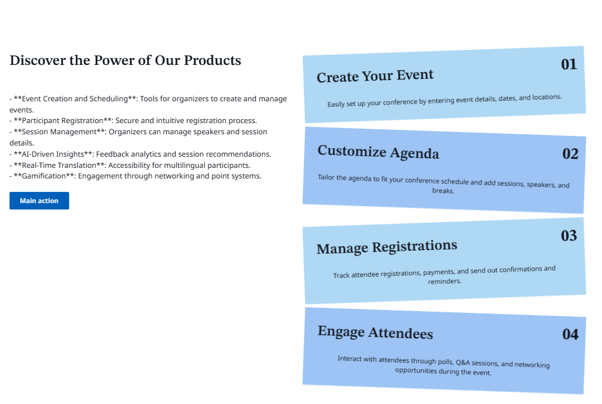
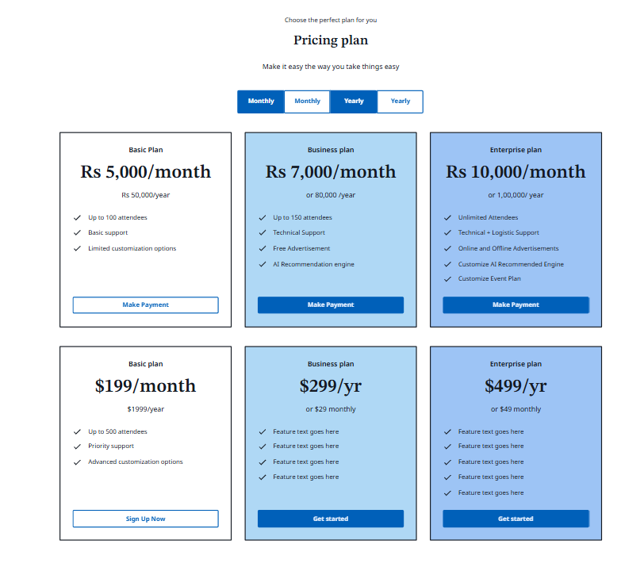
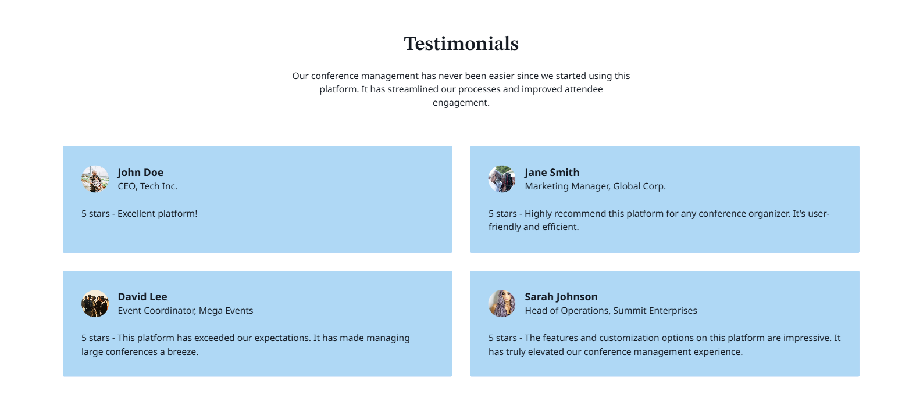
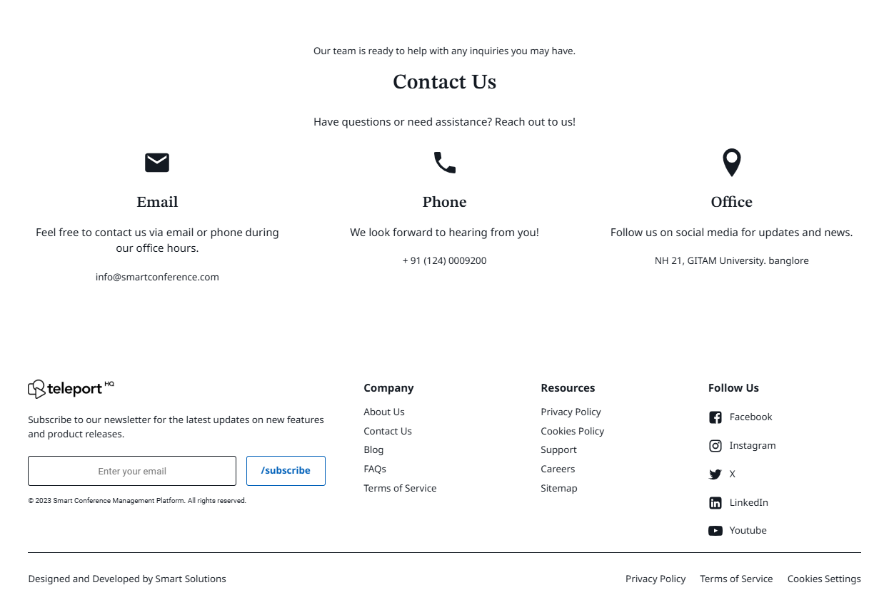

# **Smart Conference Management Platform (SCMP)**

The **Smart Conference Management Platform (SCMP)** is a modern web application designed to streamline the management of conferences. It allows organizers to manage events, participants to register and engage, and speakers to manage sessions, all in one platform. SCMP features AI-powered recommendations, real-time notifications, and multilingual support, making it the ultimate solution for conferences of all sizes.

---

## **Features**

### **For Organizers**
- **Create and Manage Events**: Effortlessly schedule and customize events.
- **Track Event Analytics**: Gain insights into participant engagement and event performance.
- **Notifications**: Send real-time updates to participants through email and SMS.

### **For Participants**
- **Browse and Register for Events**: Easily find events and register.
- **Personalized Recommendations**: Receive session and networking recommendations powered by AI.
- **Real-Time Language Translation**: Participate in conferences regardless of language barriers.

### **For Speakers**
- **Manage Sessions**: Upload materials, manage session timings, and interact with participants.
- **Engage with Attendees**: Receive feedback and participate in Q&A sessions.

---

## **Screenshots**

### **Homepage**

### **Past/Ongoing Events**

### **Ongoing Event Speaker**

### **SCMP Detailed Webpage**

### **Features**

### **Payment Page**

### **Testimonals**

### **Address and Conact Us**

---

## **Future Enhancements** 

- **Payment Gateway Integration: For processing ticket payments.
- **Mobile App Support: Develop native mobile apps for iOS and Android.
- **AI-Powered Analytics: Provide detailed insights into event performance and participant engagement.
- **Advanced Gamification: Implement leaderboards, challenges, and reward systems.
---

## **License**
- **This project is licensed under the MIT License. See the LICENSE file for more details.

